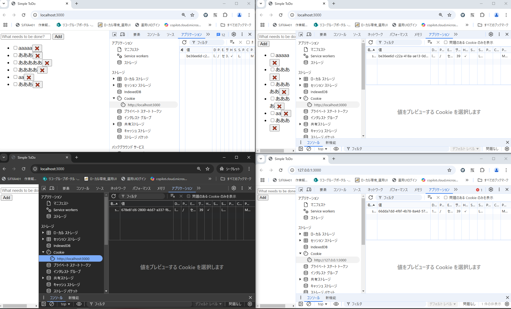

# ch15.11-15/ex01

## 問題

### このサーバでは Cookie を使ってクライアントのセッションを識別し、タスク一覧をセッションごとに分離して管理する簡易的な認証/認可を行っている。サーバが設定している Cookie の値は sid=<セッションに一意に割り当てた ID>; SameSite=Lax; Path=/; HttpOnly; である。ToDo アプリでいくつかのタスクを作成した後、以下に挙げる操作を実施したとき、それぞれどのような結果になるか記載し、その理由を説明しなさい。

- 同一ブラウザの異なるタブあるいはウィンドウ
    - タスクが表示される
    - sidは同じ
- シークレットウィンドウ
    - タスクは表示されない
    - sidが異なる
- http://127.0.0.1:3000で開く
    - タスクは表示されない
    - sidが異なる

- なぜこのような結果になるのか
    - シークレットウィンドウではアクティビティが保存されず、またログインといった認証なしだと常に新しいユーザーとして認識される仕様であり、sessionIDも保存されないから。
    - http://127.0.0.1:3000の場合はIPアドレスが違うから？

### 参考リンク
- [Chrome のシークレット モードでブラウジングのプライバシーが保護される仕組み](https://support.google.com/chrome/answer/9845881?hl=ja#zippy=%2C%E3%82%B7%E3%83%BC%E3%82%AF%E3%83%AC%E3%83%83%E3%83%88-%E3%83%A2%E3%83%BC%E3%83%89%E3%81%AE%E4%BB%95%E7%B5%84%E3%81%BF)