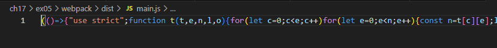

# ch17/ex05

## ライフゲームのプログラムについて、プログラム中の関数(updateGrid, renderGrid)をそれぞれ別のファイルで export し、index.js から import して利用するよう修正しなさい。必要に応じて定数の export や関数の引数の変更を行ってもよい。上記のコードを webpack を利用してバンドルし、バンドル前後のコードについて以下の点を調査して結果を記載しなさい。

### バンドルしたコードと元のコードを比較し、どのような処理が行われたかを確認しなさい。
- 一行にまとまっている
- 関数名や引数名などが1文字で簡略化されている
- 複数ファイルに分けているが1つに集約されている
-

### バンドル前後それぞれのコードを利用するページをローカルサーバで配信してブラウザから閲覧できるようにしなさい。開発者ツールで ネットワーク タブを開き、スクリプトのダウンロード時間、ページの読み込み完了時間について比較しなさい。

#### 結果
- webpackによるバンドルなし
    - スクリプトのダウンロード時間
        - index.js：0.48ミリ秒
        - renderGrid.js：0.50ミリ秒
        - updateGrid.js：0.75ミリ秒
    - ページの読み込み完了時間
        - DOMContentLoaded：63ミリ秒
        - 読み込み：112ミリ秒
        - リソース：30.6kB
- webpackによるバンドルあり
    - スクリプトのダウンロード時間
        - main.js：0.99ミリ秒
    - ページの読み込み完了時間
        - DOMContentLoaded：62ミリ秒
        - 読み込み：221ミリ秒
        - リソース：27.2kB

#### 確認方法
1. 開発者ツールを開く
1. 「ネットワーク」タブを選択
1. ページをリロード
1. スクリプトのダウンロード時間を確認
    1. 「ネットワーク」タブに表示されているリストからスクリプトファイルをクリック
    1. 「タイミング」セクションにある「コンテンツのダウンロード」の時間を確認
1. ページ読み込み時間を確認
    1. 「ネットワーク」タブの下部にある「DOMContentLoaded」と「読み込み」の時間を確認(ついでにリソースも確認)