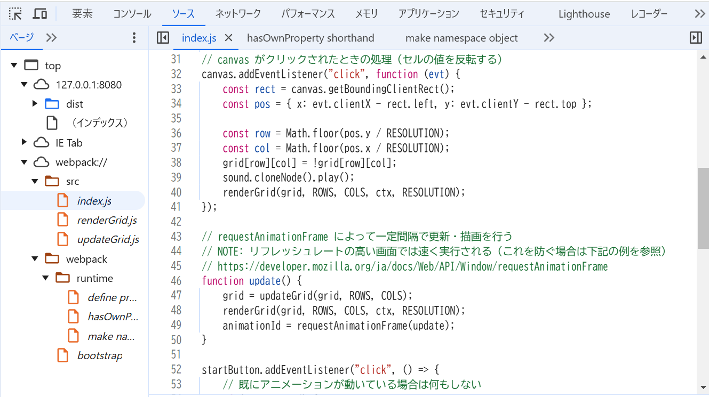
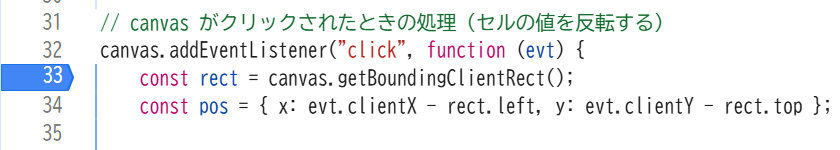
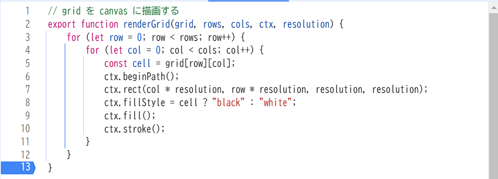
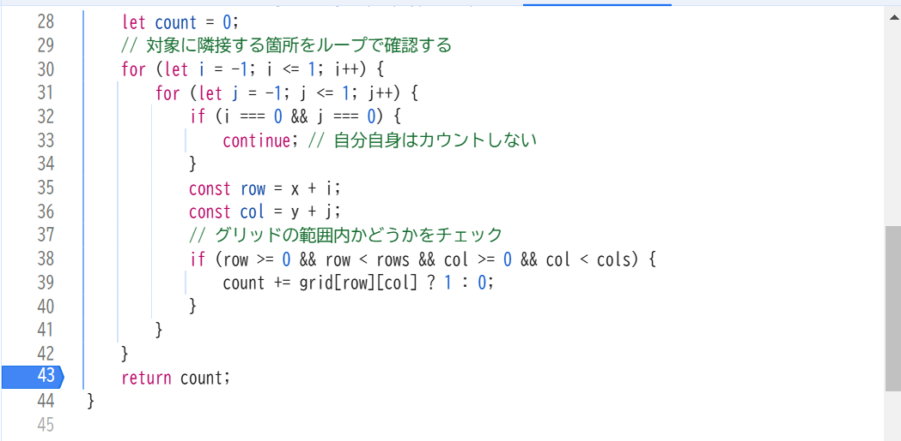
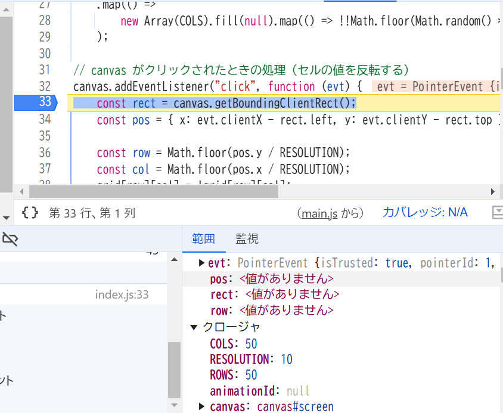
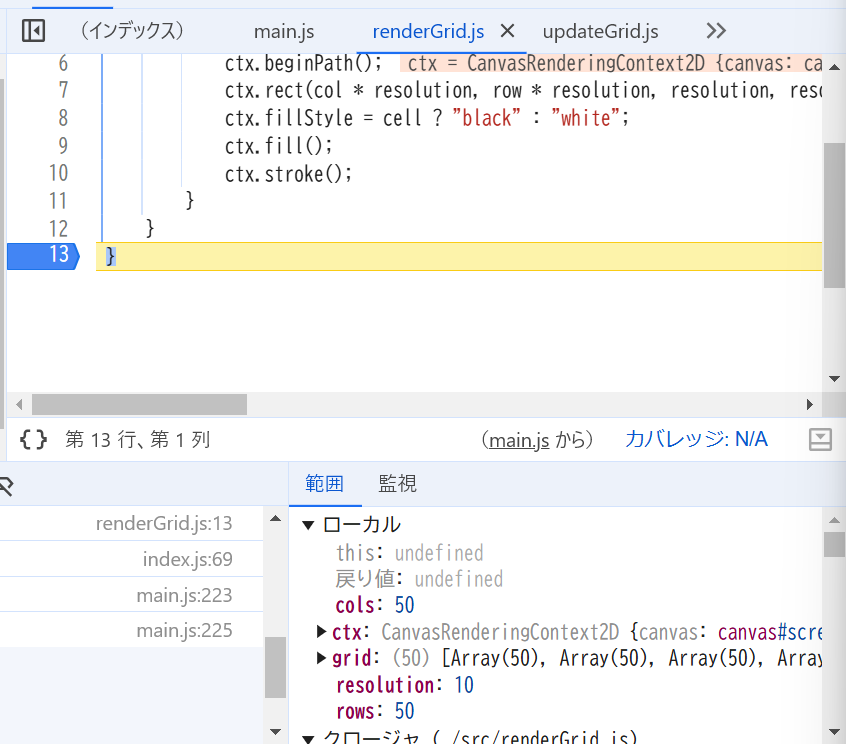
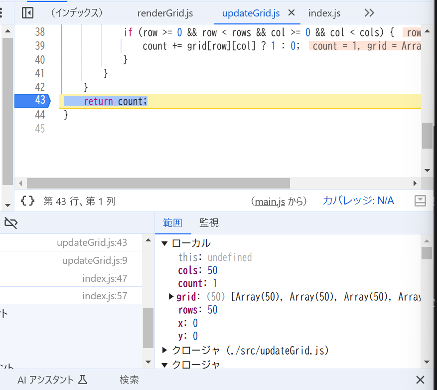

# ch17/ex06

## 問題 17.5 について、webpack の設定でバンドル時にソースマップを生成するようにしなさい。バンドルしたコードを利用するページをローカルサーバで配信してブラウザから閲覧し、開発者コンソールを利用して以下を確認して結果を記載しなさい。

### 開発者ツールで ソース タブ(Chrome, Edge, Safari) または デバッガー タブ(Firefox) を開き、ソースコードファイルがどのように表示されるかを確認しなさい。

- 表示結果
    - 
    - Chromeで検証
    - webpack://というフォルダが追加されており、その中にバンドル前のソースコードが表示されるようになる。
    - webpack://内にwebpackというフォルダも生成されている

### バンドルしたコードの実行中に、バンドル前のソースコードファイルに基づいたブレークポイントの設定や変数の値の確認等のデバッグが可能か確認しなさい。

- 結論
    - index.jsも、index.jsから呼び出されるrenderGrid.jsやupdateGrid.jsもブレークポイントを設定して変数の値の確認等のデバッグが可能である。
- 実施方法
    1. バンドル前の各ファイルにブレークポイントを設置
        - index.js: canvasがクリックされた時の処理内
            - 
        - renderGrid.js:  処理の最後
            - 
        - updateGrid.js: countをreturnする時
            - 
    1. 各ブレークポイントを通る処理を実施
        - index.js: セルをクリック
            - 
        - renderGrid.js: リロード
            - 
        - updateGrid.js: ライフゲームをスタートする
            - 